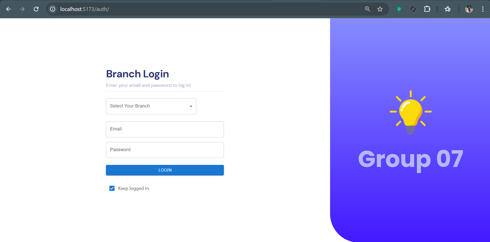

# Electricity-Billing-System

## Prerequisites

- Java Development Kit (JDK) installed (version 8 or higher)
- MySQL must be installed and running on your machine.
- You need access to a MySQL user account with privileges to create other users and grant permissions (such as the `root` user).
- [Apache Maven](https://maven.apache.org/) installed


## Database Setup

This guide provides instructions for setting up MySQL database access by creating a dedicated user with the necessary privileges for the application. Follow these steps to ensure the application can connect to the database correctly.

### Steps to Create a Database and User

#### 1. Log into MySQL as an Admin User

```bash
mysql -u root -p
```

#### 3. Create a New User
```sql
CREATE USER IF NOT EXISTS 'group07'@'localhost' IDENTIFIED BY 'your_password';
```

#### 4. Grant Privileges to the New User
```sql
GRANT ALL PRIVILEGES ON *.* TO 'group07'@'localhost' WITH GRANT OPTION;
FLUSH PRIVILEGES;
```

#### 5. Create a New Database
```sql
CREATE DATABASE IF NOT EXISTS electricity-billing-system;
```

Open your terminal and log into MySQL using a privileged user, such as `root`:

## Configure Application Properties

In your project, set up database and Flyway properties in the `application.yml` file. Below is an example configuration:

```yaml
# application.yml
spring:
  application:
    name: electricity-billing-api
  datasource:
    url: jdbc:mysql://localhost:3306/electricity-billing-system
    username: root
    password: password
  jpa:
    hibernate:
      ddl-auto: none
    show-sql: true
  flyway:
    enabled: true
    validate-on-migrate: true
    baseline-on-migrate: true
    locations: classpath:db/migration


```
## Repairing Flyway Migrations

If you encounter database migration issues, such as partially applied migrations or validation failures, use Flyway's repair command to fix them.

### Steps to Repair Flyway

1. **Navigate to the Project Directory**:
    - Open a terminal or command prompt.
    - Navigate to the root directory of the project where the `pom.xml` file is located.

2. **Run Flyway Repair**:
    - Execute the following Maven command to repair Flyway:
      ```bash
      mvn flyway:repair
      ```
    - This command will clean up the Flyway schema history table and remove any failed migrations.

3. **Re-run the Application**:
    - Once the repair is complete, re-run the application to reapply any migrations.

### Additional Flyway Commands

- **Clean Database** (only for development/testing):
  ```bash
  mvn flyway:clean
   ```
### Sign In



